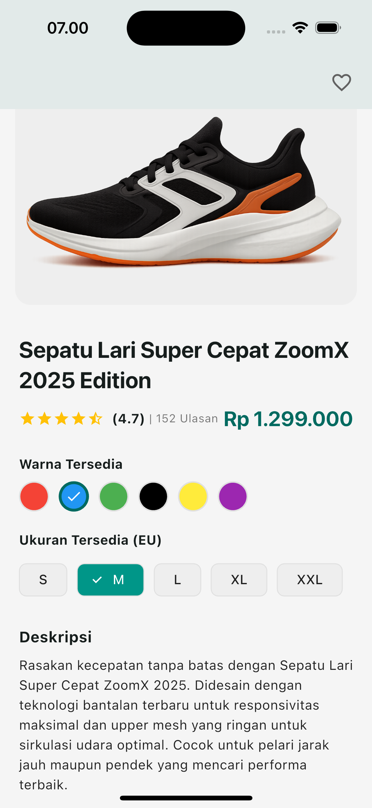

# Penjelasan Program dan Fitur
Layout Halaman Produk merupakan aplikasi Flutter sederhana yang dirancang untuk menampilkan halaman detail produk secara responsif. Aplikasi ini menekankan penggunaan berbagai widget layout Flutter untuk membangun antarmuka pengguna yang menarik dan mudah disesuaikan di berbagai ukuran layar.
# Fitur Utama Aplikasi:
•	Tampilan Produk: Menampilkan gambar produk, nama, deskripsi singkat, dan harga.
•	Layout Responsif: Menggunakan LayoutBuilder untuk menyesuaikan tampilan antara satu kolom dan dua kolom tergantung lebar layar.
•	Opsi Produk: Menyediakan pilihan warna dan ukuran produk menggunakan widget Wrap agar fleksibel dalam tampilan multi-baris.
•	Tombol Aksi: Tersedia tombol untuk menambahkan produk ke keranjang (Add to Cart) atau langsung membeli (Buy Now).
•	Desain Konsisten: Menggunakan tema global (ThemeData) yang didefinisikan dalam AppTheme untuk mengatur warna, teks, dan gaya komponen aplikasi secara terpusat.
•	Scroll Layout: Mendukung scroll vertikal menggunakan SingleChildScrollView untuk memastikan seluruh konten dapat diakses di layar kecil.
•	Struktur Kode Modular: Komponen layout dipisahkan ke dalam fungsi-fungsi terpisah untuk meningkatkan keterbacaan dan pemeliharaan kode.
•	Penggunaan Aset Gambar: Menampilkan gambar produk dari folder aset lokal (images/running_shoes.png).
# Komponen Layout yang Digunakan:
•	Scaffold dan AppBar sebagai kerangka utama halaman.
•	Column, Row, Wrap, dan Expanded untuk menyusun elemen-elemen UI.
•	Padding, SizedBox, dan AspectRatio untuk pengaturan jarak dan ukuran elemen.
•	Card, Container, dan Chip untuk penataan visual konten produk.
Aplikasi ini cocok digunakan sebagai referensi belajar Flutter, khususnya dalam membangun layout yang rapi, terstruktur, dan responsif dengan praktik terbaik dalam penggunaan widget layout dan theming.

# Screenshot Aplikasi

